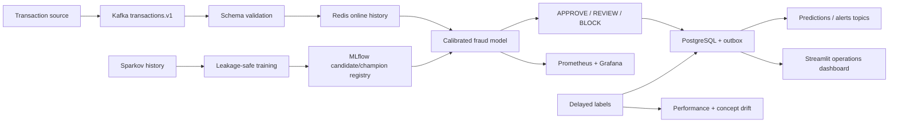

# Real-Time Fraud Detection Platform

**Personal ML systems portfolio project by Harsha Sanka**

[](https://github.com/HarshaSanka/real-time-fraud-detection/actions/workflows/ci.yml)
[](pyproject.toml)
[](LICENSE)

A production-oriented ML system for detecting fraudulent financial transactions using
behavioral and velocity features, calibrated gradient-boosted models, cost-sensitive
APPROVE/REVIEW/BLOCK policies, Kafka streaming, Redis online state, explainability,
delayed-label monitoring, and human-gated retraining.

> This independent project uses the public **synthetic** Sparkov dataset. It is not affiliated
> with a bank, card network, Kaggle, or the Sparkov authors, and it does not claim production
> traffic, business impact, or unmeasured scale.

## Project status

Implementation and measured full-data verification are in progress. This section will be
replaced with generated evidence; no placeholder metric is presented as a result.

## Architecture



## Quick start

```bash
python3.13 -m venv .venv
source .venv/bin/activate
python -m pip install -e '.[all]'
cp .env.example .env
fraud-detect data download
fraud-detect data validate
fraud-detect data process --profile portfolio
fraud-detect features build --profile portfolio
fraud-detect train benchmark --profile portfolio
```

Complete measured results, setup, design decisions, and recruiter navigation will be added
after the executable quality gates finish.
