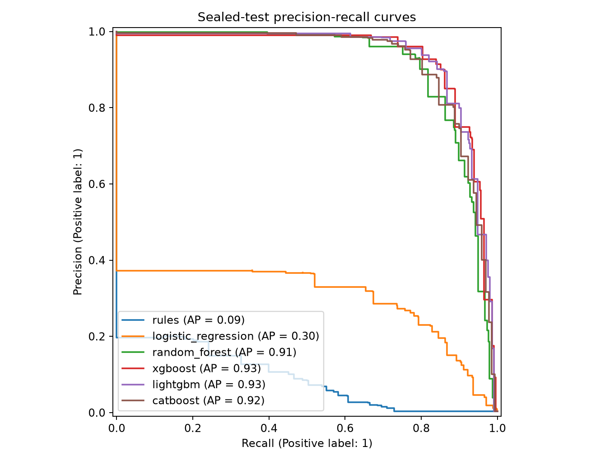
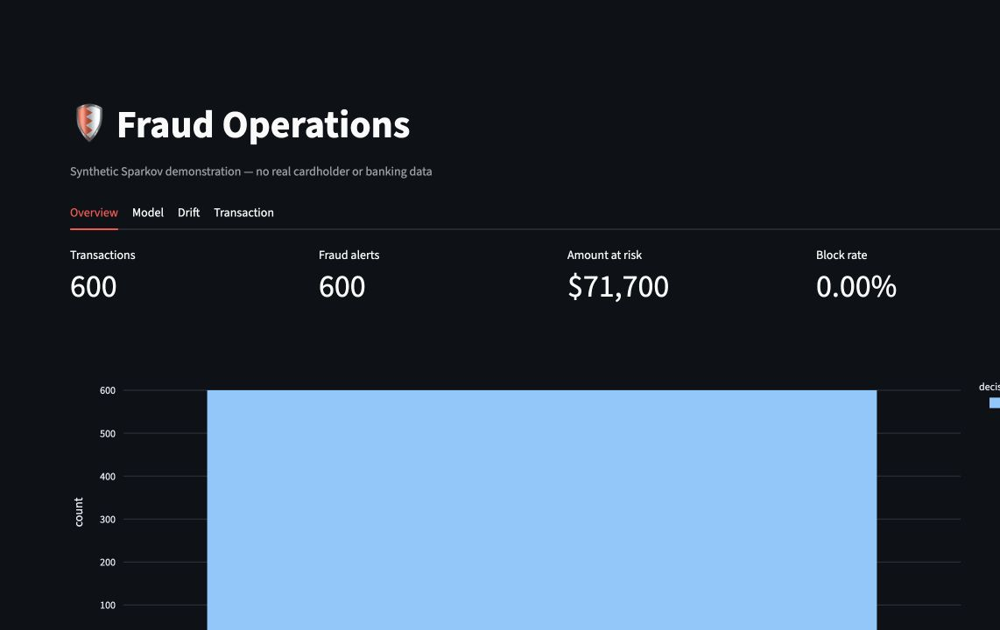
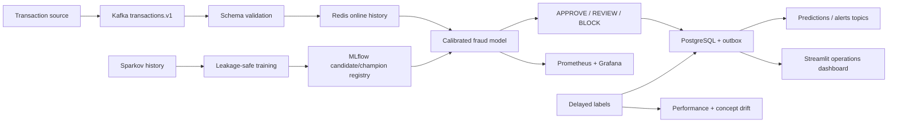
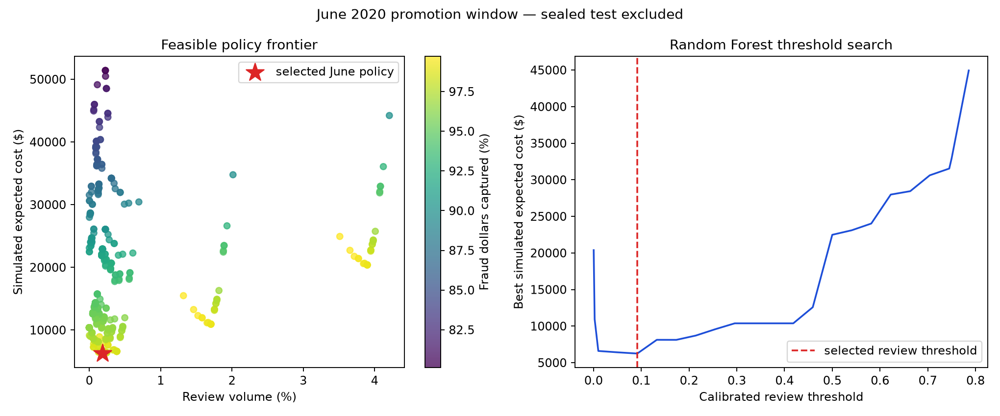
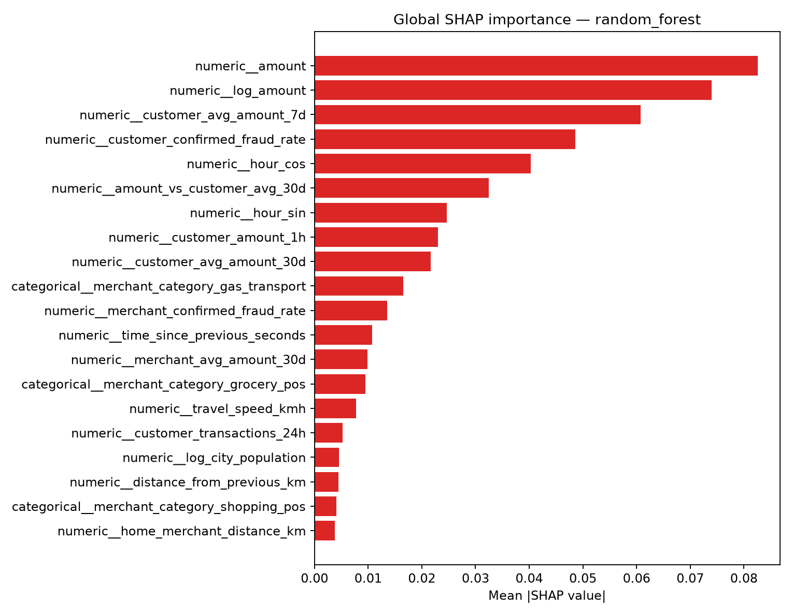
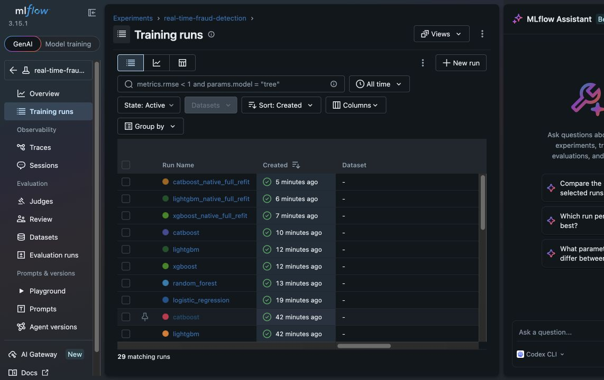

# Real-Time Fraud Detection Platform

**Personal ML systems portfolio project by Harsha Sanka**

[](https://github.com/HarshaSanka/real-time-fraud-detection/actions/workflows/ci.yml)
[](pyproject.toml)
[](LICENSE)

A production-oriented ML system for detecting fraudulent financial transactions using
behavioral and velocity features, calibrated gradient-boosted models, cost-sensitive
APPROVE/REVIEW/BLOCK policies, Kafka streaming, Redis online state, explainability,
delayed-label monitoring, and human-gated retraining.

> This independent project uses the public **synthetic** Sparkov dataset. It is not affiliated
> with a bank, card network, Kaggle, or the Sparkov authors, and it does not claim production
> traffic, business impact, or unmeasured scale.

## Verified scope

| Evidence | Measured result |
|---|---|
| Source validation | 1,852,394 transactions; 9,651 frauds; no duplicate IDs or missing values |
| Privacy-safe feature table | 1,852,394 ordered rows; 34 typed columns; raw identity fields excluded |
| Fixed sealed test | 525,661 transactions; 2,012 frauds; July–December 2020 |
| Model comparison | Rules, logistic, random forest, XGBoost, LightGBM, and CatBoost |
| Tuning | 20 pre-test Optuna trials each for XGBoost and LightGBM |
| Champion | Random forest, selected only from validation PR-AUC and June policy evidence |
| Test PR-AUC | Random forest 0.9097; XGBoost 0.9297; LightGBM 0.9313 |
| Champion operations | 92.79% recall; 60.19% precision; 97.61% fraud-dollar capture |
| Champion volume | 0.19% review; 0.40% block |
| Calibration | Isotonic; Brier 0.000848; expected calibration error 0.000385 |
| Public CI | [Run #3](https://github.com/HarshaSanka/real-time-fraud-detection/actions/runs/31650537957) passed quality, security audit, image/Compose, and 20-event streaming smoke gates |

All costs are simulated. Test metrics are reporting-only and do not select or promote a
model. Detailed evidence lives in [`reports/benchmark_summary.json`](reports/benchmark_summary.json)
and the [model card](docs/model_card.md).

| Model | PR-AUC | Recall | Precision | Simulated cost |
|---|---:|---:|---:|---:|
| Logistic regression | 0.3031 | 82.80% | 22.79% | $146,579.86 |
| Random forest (champion) | 0.9097 | 92.79% | 60.19% | $39,357.60 |
| XGBoost | 0.9297 | 95.68% | 58.33% | $40,604.99 |
| LightGBM | 0.9313 | 94.88% | 61.23% | $44,501.12 |
| CatBoost | 0.9196 | 94.43% | 57.59% | $44,188.74 |

LightGBM leads sealed-test PR-AUC, but random forest remains champion because it achieved the
lowest feasible **June promotion-window** cost. Selecting LightGBM from the test table would
violate the sealed-test boundary.





## Architecture



## Quick start

Python 3.12 and 3.13 are supported. The full workflow downloads about 580 MB of CSV data and
builds local Parquet/model artifacts that are intentionally ignored by Git.

```bash
python3.13 -m venv .venv
source .venv/bin/activate
python -m pip install -e '.[all]'
cp .env.example .env
fraud-detect data download
fraud-detect data validate
fraud-detect data process --profile portfolio
fraud-detect features build --profile portfolio
fraud-detect train benchmark --profile portfolio
fraud-detect train explain --profile portfolio
fraud-detect monitor run --profile portfolio
```

For a smaller local/CI exercise, create the sanitized fixture and use `--profile ci`:

```bash
python scripts/create_ci_fixture.py
fraud-detect features build --profile ci
fraud-detect train benchmark --profile ci
```

CI/demo artifacts never supply headline metrics. The full portfolio reports above are
committed separately and regression-tested.

## Business-aware policy

The model emits a calibrated probability. A June 2020 promotion window supplies two distinct
thresholds for `APPROVE`, `REVIEW`, and `BLOCK`. The optimizer searches policies subject to a
5% review cap, 1% block cap, and 80% fraud-value capture target. Among feasible policies it
minimizes a transparent simulated objective:

```text
approved fraud: 100% of transaction amount
review: $5 per transaction; 80% of fraudulent value captured
false block: $25 modeled customer friction
```

These are scenario assumptions, not bank economics. Changing them can change the champion and
the thresholds. See the [fraud strategy](docs/fraud_strategy.md) and the committed
[threshold grids](reports/threshold_grid_random_forest.csv).



## Leakage-safe feature contract

One ordered state engine powers offline training and the Redis-backed online reference
implementation. It emits the feature row *before* adding the current event to state. Tests
replay identical sequences through memory and Redis and assert parity. Features include:

- amount/time/category/geographic context;
- 5-minute, 30-minute, 1-hour, 24-hour, 7-day, and 30-day customer behavior;
- unique merchants, previous-location distance, travel speed, and impossible travel;
- merchant volume, amount baseline, and smoothed confirmed-fraud history; and
- cold-start and missing-history indicators.

Customer and merchant fraud history changes only after a seven-day simulated label delay.
The source names, addresses, card number, gender, occupation, and birth date never enter the
processed/model tables. Synthetic card and merchant IDs are deterministically pseudonymized.

## Serving API

The versioned FastAPI contract exposes:

| Method | Route | Behavior |
|---|---|---|
| `GET` | `/health` | process liveness |
| `GET` | `/ready` | 200 only with a valid loaded bundle |
| `GET` | `/model/info` | model lineage, thresholds, calibration, and feature hash |
| `POST` | `/score` | idempotent single-event scoring |
| `POST` | `/score/batch` | validated scoring, maximum 100 events |
| `GET` | `/metrics` | bounded-label Prometheus metrics |

Start the API against a generated model:

```bash
uvicorn fraud_detection.api.main:app --host 0.0.0.0 --port 8000
curl http://localhost:8000/ready
```

OpenAPI documentation is available at `http://localhost:8000/docs`. Redis failures switch to
missing-history features and enforce at least `REVIEW`; scores above the block threshold may
still `BLOCK`. PostgreSQL persistence and its transactional outbox occur before Kafka
publication, so a broker outage delays an event instead of losing the API decision.

## One-command platform

After a demo or portfolio model bundle exists:

```bash
docker compose up --build
```

This starts the API, Kafka in single-node KRaft mode, topic initialization, scoring consumer,
Redis, PostgreSQL, outbox publisher, MLflow, Prometheus, Grafana, and Streamlit. Service URLs:

- API/OpenAPI: `http://localhost:8000/docs`
- Fraud operations: `http://localhost:8501`
- MLflow: `http://localhost:5000`
- Prometheus: `http://localhost:9090`
- Grafana: `http://localhost:3000`

Docker is unavailable on the development Mac used for the full model run. GitHub Actions is
therefore the authoritative container environment. Public [CI run
#3](https://github.com/HarshaSanka/real-time-fraud-detection/actions/runs/31650537957)
passed the runtime image and Compose gates, reached API readiness, replayed 20 Kafka events,
and verified prediction persistence, Redis state, and outbox publication.

## Monitoring and governance

Prometheus records request counts, bounded decision labels, latency histograms, and score
distributions. Grafana is provisioned from version-controlled dashboards. Streamlit provides
overview, model, drift, and transaction-explanation views. The offline monitor reports numeric
PSI and categorical Jensen–Shannon divergence. Delayed joined labels update precision, recall,
and PR-AUC; feature drift alone never proves concept drift.

SHAP supplies measured global importance and local examples for the champion. Stable reason
codes—not raw identifiers, amounts, or high-cardinality values—are returned for review/block
decisions and used in logs/metrics.



Drift or labeled degradation creates a challenger request. Promotion gates compare pre-test
PR-AUC, calibration, simulated cost, and operational volume, and always require human approval.

## Measured local inference benchmark

The in-process FastAPI benchmark executed 200 unique requests at each concurrency level on an
Apple Silicon Mac running Python 3.13.14. Redis, PostgreSQL, and Kafka were inactive, so these
numbers characterize local application/model overhead—not distributed throughput.

| Concurrency | p50 | p95 | p99 | Throughput | Errors |
|---:|---:|---:|---:|---:|---:|
| 1 | 31.4 ms | 33.5 ms | 36.6 ms | 31.6 req/s | 0 |
| 4 | 82.0 ms | 97.5 ms | 112.6 ms | 48.4 req/s | 0 |
| 16 | 334.0 ms | 428.2 ms | 573.2 ms | 46.6 req/s | 0 |

The raw evidence and environment disclosure are in
[`reports/inference_benchmark.json`](reports/inference_benchmark.json). No million-TPS or bank
production claim is made.



## Test and evidence gates

```bash
ruff format --check .
ruff check .
mypy src scripts
pytest tests --cov=fraud_detection --cov-fail-under=80
jupyter nbconvert --execute --to notebook --inplace notebooks/01_fraud_eda.ipynb
```

GitHub Actions also audits dependencies, builds the runtime image, validates Compose, waits for
readiness, and exercises an actual Kafka→Redis→model→PostgreSQL→prediction/outbox path. Raw
Sparkov files, secrets, databases, and large model binaries remain untracked. See the committed
[public CI verification record](reports/ci_verification.md).

## Repository tour

| Path | Purpose |
|---|---|
| `src/fraud_detection/data` | checksummed ingestion, validation, privacy transformation, EDA |
| `src/fraud_detection/features` | shared ordered feature engine and materialization |
| `src/fraud_detection/training` | models, imbalance experiments, Optuna, MLflow, promotion |
| `src/fraud_detection/inference` | predictor, decision engine, Redis/degraded feature stores |
| `src/fraud_detection/streaming` | Kafka producer/consumer, schemas, DLQ, outbox, labels |
| `src/fraud_detection/monitoring` | feature drift and delayed-label performance |
| `tests` | unit, integration, full-data, and artifact-regression gates |
| `reports` | generated metrics and plots; never hand-entered quality numbers |
| `docs` | architecture, data dictionary, model card, operations, interview guide |

## Dataset and limitations

The CC0 [Kaggle Sparkov fraud dataset](https://www.kaggle.com/datasets/kartik2112/fraud-detection)
was generated with [Sparkov](https://github.com/namebrandon/Sparkov_Data_Generation). The two
source files are checksum-pinned in configuration, combined, and then chronologically split.
They are misleadingly named `fraudTrain.csv` and `fraudTest.csv`; those source filenames are
not used as ML train/test boundaries.

Sparkov is synthetic and has generator artifacts. It lacks device, IP/network, authentication,
card-present, payment-method, channel, and country signals. The repository does not manufacture
those analyses. Real deployment would require tokenization, PCI segmentation, access controls,
model-risk validation, fairness/adverse-impact work, investigator feedback, resilient state
processing, and controlled shadow/canary rollout.

## Documentation

- [Architecture](docs/architecture.md)
- [Business problem](docs/business_problem.md)
- [Data dictionary](docs/data_dictionary.md)
- [Fraud strategy](docs/fraud_strategy.md)
- [Model card](docs/model_card.md)
- [Monitoring and delayed labels](docs/monitoring.md)
- [API contract and failure semantics](docs/api.md)
- [Interview guide and measured resume bullets](docs/interview_guide.md)
- [Security](SECURITY.md)
- [Final structured review](docs/final_review.md)

## License

Code is MIT licensed. The source dataset is CC0. See [LICENSE](LICENSE) and the dataset source
for details.
