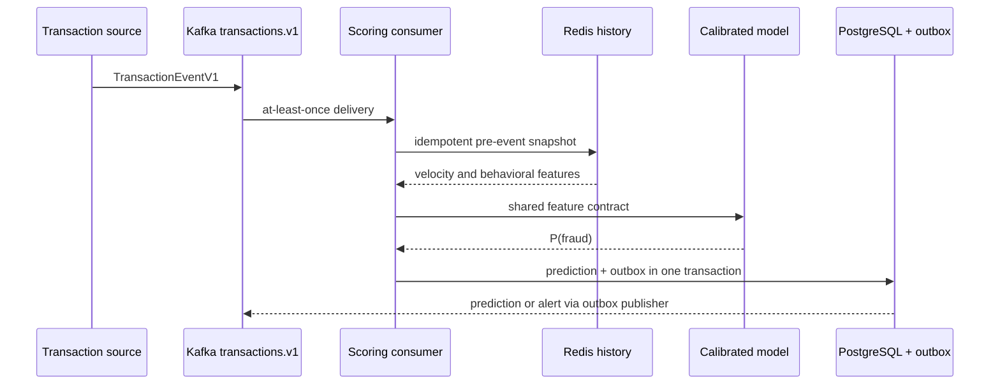

# Architecture and data flow

## Online authorization

The API uses the same scoring service. Transaction IDs make scoring and feature-state updates
idempotent. Redis failure activates `history_unavailable=1`; the model still scores, but the
decision engine enforces at least `REVIEW`. Model absence causes `/ready` and scoring to return
503 while `/health` remains alive.

## Offline lifecycle

```mermaid
flowchart LR
    A["Pinned Sparkov CSVs"] --> B["Validation + pseudonymization"]
    B --> C["Chronological feature replay"]
    C --> D["Train / tune / calibration / threshold / test"]
    D --> E["Baselines + five supervised models"]
    E --> F["Optuna on pre-test data"]
    F --> G["Isotonic or Platt calibration"]
    G --> H["Cost-aware threshold policy"]
    H --> I["MLflow candidate/champion"]
    I --> J["Human-approved deployment"]
```

The source files named `fraudTrain` and `fraudTest` are not accepted as canonical ML splits.
They are combined, sorted, and divided at fixed calendar cutoffs. The sealed July–December
2020 test period is reporting-only.

## Exactly what Redis demonstrates

The laptop demo stores a serialized reference engine behind a Redis distributed lock, plus
per-transaction snapshots for retry safety. This provides exact parity with offline replay
and is appropriate for a single-node demonstration. A real high-throughput design would
partition state by customer in Flink/Kafka Streams or use per-key Redis Lua/functions rather
than one global lock. No million-TPS claim is made.
